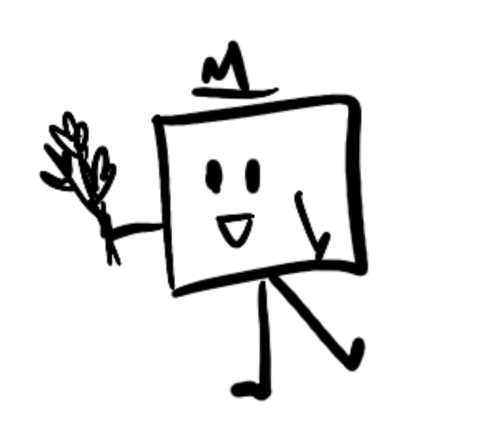

<!-- Improved compatibility of back to top link: See: https://github.com/othneildrew/Best-README-Template/pull/73 -->

[![Contributors][contributors-shield]][contributors-url]

<!-- PROJECT LOGO -->
 

  

  <h1 align="center">Square Up</h1>
  <h2 align="center"> A picture is worth a thousand words, so we took a whole bunch.</h2>

  

    Built By Ashley Anderson, Daniel He, Sughra Hussain, Larris Xie
     
     
    <a href="https://square-up-pearl.vercel.app/home"><strong>Visit the Demo »</strong></a>
     
     
  

<!-- TABLE OF CONTENTS -->

  
Table of Contents

  <ol>
    <li>
      <a href="#about-the-project">About The Project</a>
      <ul>
        <li><a href="#built-with">Built With</a></li>
      </ul>
    </li>
    <li><a href="#usage">Usage</a></li>
  </ol>

<!-- ABOUT THE PROJECT -->
## About The Project

Square Up was made during Hack Western 11. It is a web app that allows groups to make photo mosaics's in a few simple steps:

### What the Host Does:
  1. Uploads an image.
  2. Select how many pieces to split it into..
  3. Share the generated QR code with friends...
  4. Watch the mosaic come together!

### What the Users Do:
1. Each person who scans the QR code recieves a unique piece of the image.
2. Users send back their own picture that resmbles the piece.
3. That's it!

The app handles the rest by stitching the images together to create a one-of-a-kind mosaic! 

We wanted to encorporate the digital and physical world to inspire groups to have fun collaborating, sharing pictures from their lives, and ultimately getting to build something special together.

### Built With

[![React][React-shield]][react-url] [![Flask][Flask-shield]][flask-url] [![AWS][AWS-shield]][aws-url] [![Python][Python-shield]][python-url] [![Figma][Figma-shield]][figma-url] [![Vite][Vite-shield]][vite-url] [![WebSockets][WebSockets-shield]][websockets-url] [![JavaScript][JavaScript]][js-url] [![HTML5][HTML5]][html-url] [![CSS3][CSS3]][css-url]

<!-- USAGE EXAMPLES -->
## Usage

Fill later

(<a href="#readme-top">back to top</a>)

<!-- MARKDOWN LINKS & IMAGES -->
<!-- https://www.markdownguide.org/basic-syntax/#reference-style-links -->
[license-shield]: https://img.shields.io/badge/License-GPL%202.0-blue.svg?style=for-the-badge
[license-url]: https://www.gnu.org/licenses/old-licenses/gpl-2.0.html

[JavaScript]: https://img.shields.io/badge/JavaScript-F7DF1E?style=for-the-badge&logo=javascript&logoColor=000000
[js-url]: https://developer.mozilla.org/en-US/docs/Web/JavaScript

[HTML5]: https://img.shields.io/badge/HTML5-E34F26?style=for-the-badge&logo=html5&logoColor=FFFFFF
[html-url]: https://developer.mozilla.org/en-US/docs/Web/HTML

[CSS3]: https://img.shields.io/badge/CSS3-2965F1?style=for-the-badge&logo=css3&logoColor=FFFFFF
[css-url]: https://developer.mozilla.org/en-US/docs/Web/CSS

[contributors-shield]: https://img.shields.io/github/contributors/Precisshley/SquareUp.svg?style=for-the-badge
[contributors-url]: https://github.com/Precisshley/SquareUp/contributors

[React-shield]: https://img.shields.io/badge/React-61DAFB?style=for-the-badge&logo=react&logoColor=000000
[react-url]: https://reactjs.org/

[Flask-shield]: https://img.shields.io/badge/Flask-000000?style=for-the-badge&logo=flask&logoColor=white
[flask-url]: https://flask.palletsprojects.com/

[AWS-shield]: https://img.shields.io/badge/AWS-232F3E?style=for-the-badge&logo=amazonaws&logoColor=FF9900
[aws-url]: https://aws.amazon.com/

[Python-shield]: https://img.shields.io/badge/Python-3776AB?style=for-the-badge&logo=python&logoColor=FFFFFF
[python-url]: https://www.python.org/

[Figma-shield]: https://img.shields.io/badge/Figma-F24E1E?style=for-the-badge&logo=figma&logoColor=white
[figma-url]: https://www.figma.com/

[Vite-shield]: https://img.shields.io/badge/Vite-646CFF?style=for-the-badge&logo=vite&logoColor=FFFFFF
[vite-url]: https://vitejs.dev/

[WebSockets-shield]: https://img.shields.io/badge/WebSockets-1C7C7D?style=for-the-badge&logo=websockets&logoColor=FFFFFF
[websockets-url]: https://developer.mozilla.org/en-US/docs/Web/API/WebSockets_API
